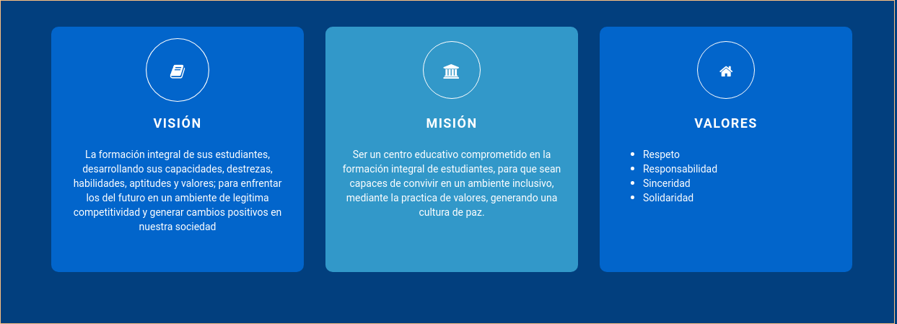

# Sitio Oficial Nuevo Lourdes

Esta es una guia basica para la edición y publicación de contenido en este sitio web, los resultados seran visibles en la siguiente URL https://nuevolourdes.github.io/.

## Obteniendo Archivos del Sitio

Para obtener los archivos del sitio para modificarlo, es necesario tener la ultima versión de `git` instalada en su computadora, a continuación se presentan guías para hacerlo en distintos sistemas operativos, el sistema recomendado es Ubuntu.

* Windows: [Descargar aquí](https://git-scm.com/download/win)
* Ubuntu: [Seguir guia](https://git-scm.com/book/es/v1/Empezando-Instalando-Git#Instalando-en-Linux)

Luego de seguir estos pasos, luego de instalar `git` deberíamos de tener una consola especial llamada `git Bash` en el caso de Windows, en Linux se puede utilizar la consola usual para los siguientes pasos, deberá ejecutar los siguientes comandos (cada $ es un comando distinto, no incluirlo al digitar los comandos):


``` bash
$ git clone https://github.com/nuevolourdes/sitio
$ cd sitio
$ git submodule add -b master \
https://github.com/nuevolourdes/nuevolourdes.github.io.git public
```

Luego de eso, se tendrá un folder cuya estructura se verá parecida a lo siguiente:

``` 
├── archetypes/
│   └── default.md
├── config.toml
├── content/
│   ├── acercade.md
│   └── noticias/
│       ├── entreganotas.md
│       ├── intramuros.md
│       └── nuevopost.md
├── data/
│   ├── carousel/
│   │   ├── confiable.yaml
│   │   └── valores.yaml
│   └── features/
│       ├── ambiente.yaml
│       ├── educacion.yaml
│       └── valores.yaml
├── layouts/
    └── shortcodes/
        └── md.html
```

## Añadiendo Nuevo Contenido

Para añadir nuevo contenido o remover contenido viejo, deberemos tener instalado un programa llamado `hugo`, descarga el archivo respectivo para poder correrlo en tu sistema operativo:

* Windows: [Hugo para windows](https://github.com/gohugoio/hugo/releases/download/v0.52/hugo_0.52_Windows-64bit.zip)
* Ubuntu:  [Hugo para linux](https://github.com/gohugoio/hugo/releases/download/v0.52/hugo_0.52_Linux-64bit.deb)

### Cambiando Contenido de Página frontal

``` bash
├── data/
│   ├── carousel/
│   │   ├── confiable.yaml
│   │   └── valores.yaml
│   └── features/
│       ├── ambiente.yaml
│       ├── educacion.yaml
│       └── valores.yaml
```

Podemos cambiar el contenido de la pagina frontal en varios aspectos, dentro del folder `carousel` se cambian los siguientes contenidos:


Dentro el folder `features` se cambian los siguientes aspectos de la página:




### Añadiendo Noticias

Podemos hallar el contenido actual bajo esta estructura, en el folder `contents`:

```
├── content/
│   ├── acercade.md
│   └── noticias/
│       ├── entreganotas.md
│       ├── intramuros.md
│       └── nuevopost.md
```

Podemos crear un nuevo archivo con extension `.md` para crear una nueva página con el contenido de noticias, podemos simplemente copiar uno existente, renombrar y editar los contenidos del nuevo archivo, los contenidos se verán a continuación.

``` bash
---
title: "Vacaciones"
date: 2018-08-19T17:53:29-06:00
draft: false
type: "blog"
---

# Vacaciones semana santa

Sed dolor sapien, rhoncus nec urna vitae, rhoncus congue urna. 
Duis quis vehicula massa. Ut scelerisque consectetur justo. 
Nam in libero at dui lacinia scelerisque molestie id eros. 
Curabitur est felis, viverra in mauris eu, tristique efficitur 
neque. Vestibulum lorem ex, consectetur consequat justo ac, scelerisque 
dignissim sapien. In eu lobortis tellus. 
```

El texto bajo `title`, sera el titulo de nuestra noticia, `date` la fecha, `draft` indica si este es un borrador, siempre deberá ser `false` para asegurarnos de que nuestras noticias se publiquen siempre, finalmente en la configuración tenemos `type`, el cual en el caso de las noticias deberá estar siempre en `"blog"`.

### Markdown

este es el formato en la que la mayoria de contenido estara escrito, se explicara brevemente que significa cada elemento en este formato, a continuación un ejemplo:

``` markdown
# Este es un titulo
## Esto es un subtitulo
### Esto es un subsubtitulo

===

El bloque de arriba "===" indica una linea separadora en nuestro 
contenido, también podemos crear listas:

* este es un elemento
* este es otro elemento
* este es un tercer elemento

===

Para insertar imagenes podemos hacerlo facilmente usando el siguiente formato:
!(texto auxiliar)[/url/o/ruta/al/archivo]

Si hacemos esto sin el signo de exclamación, el resultado final 
será un link a la imagen, es decir, esta nos se mostrara.

===

esto es texto en **negrita** y esto es texto en *cursivo*
```

Para una lista más comprensiva de `markdown` se recomienda revisar este sitio: https://markdown.es/sintaxis-markdown/

## Subiendo cambios

Subir los cambios es muy sencillo, solo se requiere ejecutar el siguiente comando:

``` bash
$ bash ./deploy.sh
```
